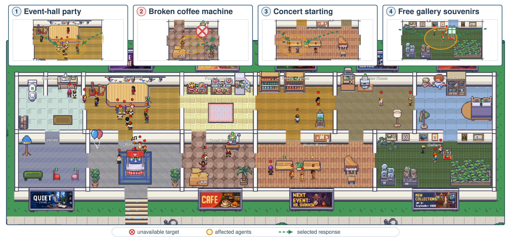

# CrowdDirector

Natural-language crowd direction for Unity, powered by a trained relational graph policy.




<sub>One generated venue, four instructions. Agents affected by each are ringed in amber, the target
the instruction removed is marked in red, and the arrow is the response the policy chose — a crowd
drawn to the event hall, drinkers rerouted off a broken machine, an audience gathering for a concert,
and a queue forming for gallery souvenirs.</sub>

Describe a space in a sentence and CrowdDirector lays out its zones and populates it. While it runs,
type instructions at the crowd — *"the coffee machine is broken"*, *"staff leave first"* — and every
agent responds according to its own needs, role and relationships.

A graph policy makes the per-agent decisions locally, at roughly **0.7 ms per agent
decision** with **no API call per tick**. Your navigation, collision handling and animation stay
exactly as they are: CrowdDirector chooses *what* each agent should do and *where*, and leaves the
execution to you.

---

## Features

- **Instruction-driven** — plain-English direction compiled against the live scene into a persistent
  directive, not a one-shot prompt.
- **Needs-driven agents** — a nine-value need model (hunger, thirst, bladder, energy, stress,
  loneliness, group affinity, status, curiosity) with Maslow-style tier ordering.
- **Social behaviour** — per-pair familiarity, trust and tension evolve into acquaintance, friendship
  or avoidance, and feed back into who talks to whom.
- **Emergencies** — evacuation is deterministic and instant, bypassing the language layer entirely.
- **Scene generation** — zones, agent types, personalities and starting needs from one sentence.
- **Scales** — decision cost is linear in agent count and independent of scene complexity.
- **Engine-agnostic execution** — implement one interface and keep your own movement stack.

---

## Requirements

| | |
|---|---|
| Unity | 2021.3 or later |
| Python | 3.10 or later, for the director server |
| Platforms | Windows, macOS, Linux — Editor and standalone |
| Dependencies | `com.unity.nuget.newtonsoft-json` (resolved automatically) |

An `ANTHROPIC_API_KEY` enables scene generation and free-text instructions. The per-agent director
runs locally and does not use it.

---

## Installation

### 1. Install the Unity package

**Package Manager → + → Add package from git URL:**

```
https://github.com/bigmmgz/CrowdDirector-UnityAddon.git?path=/unity
```

Or add it to `Packages/manifest.json` directly:

```json
{
  "dependencies": {
    "com.crowddirector.client": "https://github.com/bigmmgz/CrowdDirector-UnityAddon.git?path=/unity"
  }
}
```

### 2. Start the director server

```bash
git clone https://github.com/bigmmgz/CrowdDirector-UnityAddon.git
cd CrowdDirector-UnityAddon/server

export ANTHROPIC_API_KEY=sk-ant-...     # Windows: set ANTHROPIC_API_KEY=sk-ant-...
./start.sh                              # Windows: start.bat
```

The first run creates a virtual environment and installs PyTorch. It then serves on
`ws://localhost:8765`, which is where the Unity client connects by default.

---

## Quick start

A generated scene decides its own cast — how many agents, of which types, with which personalities and
starting needs — and the server assigns each one an id that every later message is keyed on. So you
supply a **factory**, and CrowdDirector creates one of your agents per spec.

```csharp
using UnityEngine;
using CrowdDirector;

public class VillagerFactory : MonoBehaviour, ICrowdAgentFactory
{
    public Villager prefab;

    public ICrowdAgent CreateAgent(CrowdAgentSpec spec, CrowdScene scene)
    {
        var villager = Instantiate(prefab, spec.StartPosition, Quaternion.identity);
        villager.Bind(spec, scene);          // must report spec.Id as its AgentId
        return villager;
    }

    public void DestroyAgent(ICrowdAgent agent) => Destroy(((MonoBehaviour)agent).gameObject);
}
```

Your agent implements `ICrowdAgent` — reporting its state, and acting on the director's decisions:

```csharp
public class Villager : MonoBehaviour, ICrowdAgent
{
    public string AgentId         => _spec.Id;          // the server's id, not your own
    public string AgentName       => _spec.Name;
    public string AgentType       => _spec.AgentType;
    public string PersonalityType => _spec.PersonalityType;

    public Vector2    Position      => transform.position;
    public string     CurrentZoneId => _zone;
    public CrowdNeeds Needs         => _needs;

    public void DirectorMoveToZone(string zoneId, string reason)
        => _nav.SetDestination(_scene.ZoneCentre(zoneId));

    public void DirectorRest(string reason) => _animator.Play("Sit");
    public void DirectorIdle(string reason) => _nav.ResetPath();
    // ...
}
```

Add a **Crowd Director Client** to a GameObject, point its `agentFactory` field at your factory, and
direct the crowd:

```csharp
var director = GetComponent<CrowdDirectorClient>();

director.GenerateScene("a busy hospital waiting room at visiting hour");
director.DescribeEvent("the vending machine is out of order");
director.TriggerEvent("fire_alarm", "Smoke in the east wing");
```

---

## How it works

```
Unity                          Director server                    Policy
─────                          ───────────────                    ──────
ICrowdAgent state  ──────────►  scene graph        ──────────►  graph policy
                                                                (local, per tick)
per-agent actions  ◄──────────  target + action    ◄──────────
```

Each tick, the client reports agent positions, needs and relationships. The server rebuilds a
heterogeneous scene graph — agents, zones, objects, groups and active events — enumerates the
candidate `(target, action)` pairs available to each agent, and the policy scores them. Structurally
impossible options are masked before scoring, so an agent is never told to use an object that is
full, disabled or unreachable.

Instructions take a separate path. They are compiled against the live scene's actual capabilities
into a persistent directive, so an instruction referring to something the scene does not contain is
reported as unsupported rather than silently approximated. Once compiled, the directive persists
across ticks until cleared.

---

## API reference

### `CrowdDirectorClient`

| Member | Description |
|---|---|
| `RegisterAgent(ICrowdAgent)` | Add an agent to the directed crowd |
| `UnregisterAgent(ICrowdAgent)` | Remove an agent and notify the server |
| `GenerateScene(string)` | Build zones and agent types from a description |
| `DescribeEvent(string)` | Issue a free-text instruction |
| `TriggerEvent(string, string)` | `fire_alarm`, `closing_time`, `music_starts`, `new_arrival`, `all_clear` |
| `ClearEvent()` | Cancel the active event and any standing orders |
| `Connect()` / `Disconnect()` | Manage the connection manually |
| `IsConnected`, `IsSceneReady`, `AgentCount` | State |
| `CurrentScene` | The generated scene: zones, cast, and zone lookups |
| `AgentFactory` | Set in code, or assign the `agentFactory` component in the inspector |

**Inspector:** `serverUrl`, `autoConnect`, `agentFactory`, `tickInterval` (default 3 s),
`stateInterval` (default 1.5 s), `logActions`.

**Events:** `Connected`, `Disconnected`, `SceneReady`, `ActionsReceived`, `ServerError`.

### `ICrowdAgent`

| Member | Description |
|---|---|
| `AgentId` | Stable unique identifier — required |
| `AgentName` | Display name |
| `AgentType` | Scene-specific role, e.g. `"barista"` |
| `PersonalityType` | Fixed-vocabulary type, e.g. `"solo_worker"` |
| `Position`, `CurrentZoneId`, `Needs` | Live state, reported each interval |
| `EncounterCounts`, `Relationships`, `Friends` | Social state — return `null` to opt out |
| `DirectorMoveToZone(zoneId, reason)` | Walk to a zone |
| `DirectorGroupMove(zoneId, reason)` | Move as a group |
| `DirectorStartConversation(targetId, reason)` | Approach and talk |
| `DirectorRest(reason)` / `DirectorIdle(reason)` | Rest, or stand down |

`AgentType` is regenerated for every scene; key your own logic on `PersonalityType`, which comes from
a fixed vocabulary.

### `ICrowdAgentFactory`

| Member | Description |
|---|---|
| `CreateAgent(CrowdAgentSpec, CrowdScene)` | Instantiate one agent; it must report `spec.Id` as its `AgentId` |
| `DestroyAgent(ICrowdAgent)` | Tear down an agent when a new scene replaces the current one |

### `CrowdScene` / `CrowdAgentSpec` / `CrowdZone`

`CrowdScene` carries the generated `Zones` and `Agents`, plus `ZoneCentre(zoneId)` and
`TryGetZone(...)` for turning a director decision into a world position. `CrowdAgentSpec` gives an
agent's `Id`, `Name`, `AgentType`, `PersonalityType`, `StartPosition`, `Color` and `InitialNeeds`.
`CrowdZone` gives a room's `Id`, `Label`, `ZoneType`, `Bounds` and `Centre`.

### `CrowdNeeds`

Nine `float` fields on a 0–100 scale — `hunger`, `thirst`, `bladder`, `energy`, `stress`,
`loneliness`, `groupAffinity`, `status`, `curiosity`. High means pressing, except `energy`, where low
means tired. `CrowdNeeds.Default` gives a reasonable starting point.

---

## Configuration

The server reads its settings from the environment:

| Variable | Default | Description |
|---|---|---|
| `ANTHROPIC_API_KEY` | — | Enables scene generation and free-text instructions |
| `ECGP_CKPT` | bundled | Path to the policy checkpoint |
| `ECGP_TEMP` | `1.0` | Sampling temperature; lower is greedier |
| `ECGP_SAMPLE` | `1` | Set `0` for deterministic arg-max selection |
| `ECGP_AMBIENT` | `1` | Ambient world events (spills, deliveries, arrivals) |
| `CROWDDIRECTOR_EVENTLOG` | `server/EventLog` | Audit trail and file-drop event inbox |

---

## Repository layout

```
server/          director server and the trained policy
  policy/          the graph policy, its runtime and the instruction compiler
  scene/           smart objects, affordances, needs
  assets/          smart-object catalog
  model/           the released checkpoint
unity/           Unity client package (UPM)
  Runtime/         ICrowdAgent, CrowdNeeds, CrowdDirectorClient
```
